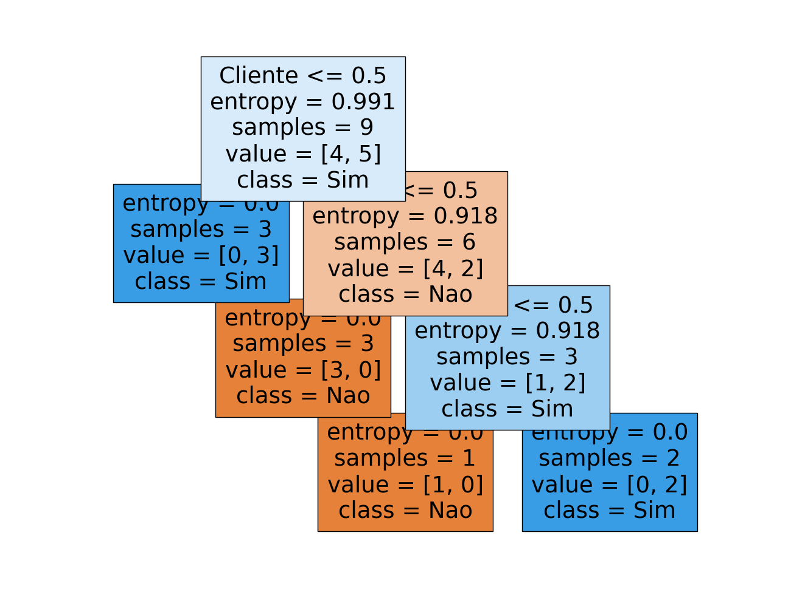
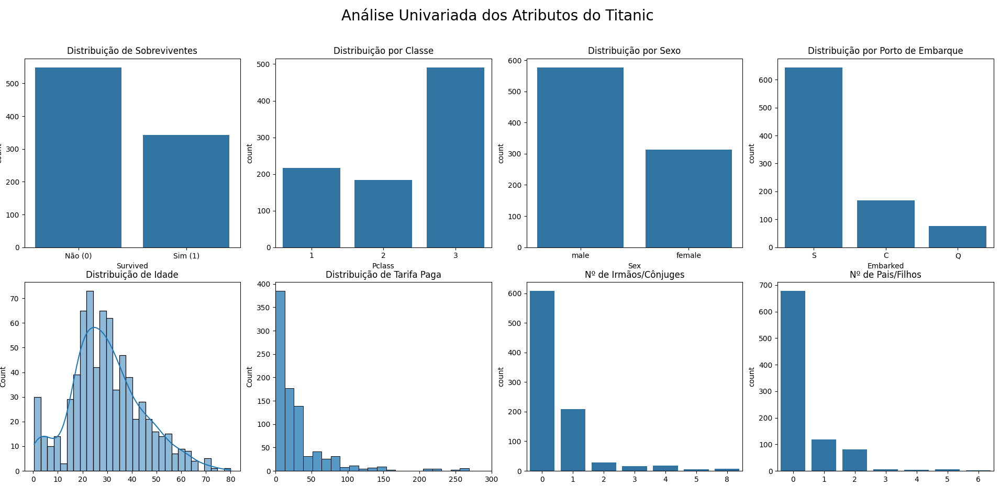

# Lista 02 - Inteligência Artificial

**Aluna:** Mariana Almeida Mendonça  
**Disciplina:** Inteligência Artificial  
**Professora:** Cristiane Neri Nobre

## Questão 01 

Em primeira ordem foi feita a trasncriçao da tabela para valores númericos, sendo que a coluna tipo foi tratada como um valor nominal.

Posteriomente, com dados tratados, foi possível gerar a Árvore de Decisão, por ser uma tabela conhecida não foram geradas testes dela, obtendo os melhores valores nela. 

## Questão 02 

Foi utilizado a base de dados `train.csv` que dava os valores de todos os dados da tabela titanic. 

Com isso foram feitas duas análises de dados, primeiro sobre os dados faltantes e segundo dos gráficos.

### Dados Faltantes 

     Column       Non-Null Count  Dtype  
---  ------       --------------  -----  
 0   PassengerId  891 non-null    int64  
 1   Survived     891 non-null    int64  
 2   Pclass       891 non-null    int64  
 3   Name         891 non-null    object 
 4   Sex          891 non-null    object 
 5   Age          714 non-null    float64
 6   SibSp        891 non-null    int64  
 7   Parch        891 non-null    int64  
 8   Ticket       891 non-null    object 
 9   Fare         891 non-null    float64
 10  Cabin        204 non-null    object 
 11  Embarked     889 non-null    object 

Sobre a análise de dados, foi possível observar que as colunas de `age`, `cabin` e `embarked` possuem dados faltantes críticos, o que pode ocasionar em impactos na nossa base de dados.

Dessa forma manter com a coluna `cabin` é completamente descessário, além disso, é necessário repensar como preencher os dados faltantes de `age` já que faltam cerca de 177 valores. Como o valor de `embarked` é baixo, podemos preenche-los com o valor mais aparente. 

As melhores escolhas portanto seriam:

* Usar o que mais se repete (moda) para o `embarked`, já que são valores baixos faltantes
* Usar a média para `age` já que possue uma quantidade considerávdel de valores nulos, podendo a moda causar alterações drásticas na base de dados
* A coluna `cabin`pode ser retirada já que possuem mais valores nulos que do que possívelmente utilizados
* Outras colunas como `Name`, `Ticket`, `PassengerId`, também podem ser retiradas já que são identificadores
* Outro ponto de melhoria seria transformar em valores númericos `Sex`, `Embarked` que são textos.

