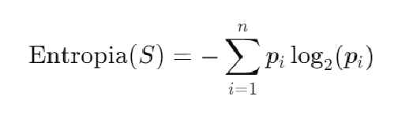
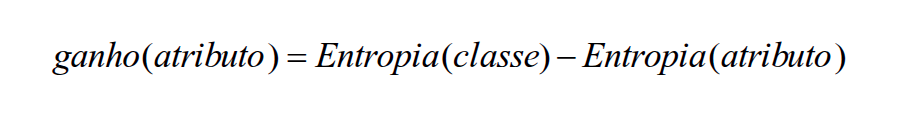

# Árvore de Decisão

A árvore de decisão é uma das ferramentas mais utilizadas dentro da área de inteligência artificial. Ela possui uma característica marcante de ser interpretável, ou seja, pode apresentar uma resposta explicada no seu final. 

Ela é simples, e sua complexidade pode ser medida por meio do seu número de folhas, profundidade e quantidade de atributos utilizados. Como segue a teoria da `Navalha de Occam`, quanto mais simples e com menos premissas melhor será a definição da hipótese que necessitamos provar. 

A árvore pode ser definida como uma disjunção de conjunções, isso porque:

- Temos inúmeros hipóteses de regras, que são nada mais do que os caminhos e os nodos intermediários da nossa árvore (`conjunção`).

- Também temos inúmeros caminhos a serem seguidos, nos dando a possibilidade (`disjunção`).

## Definição

1. Uma lista de perguntas com respostas entre "sim" e "não".
2. Hierarquia definida e arranjada.
3. Algo que leva a decisão.
4. Isso é definido por meio de aprendizado.

Sua estrutura possui uma definição básica de:

- `Nós`: teste de variáveis.
- `Ramos`: Resultado dos testes.
- `Folhas`: classificação final.

## Como gerar um Árvore de Decisão?

Para criar uma árvore temos que definir alguns passos muito importantes, como:

1. Definição dos atributos que irão compor a árvore como: *choveu ou não choveu hoje?*
2. Definir um atributo de tipo `bom`, sendo aquele que consegue classificar mais de forma mais rápida, sem necessitar de muitas camadas para definição. 

## Como calcular o ganho? 

Avaliar de forma visual é muito importante, mas tem uma avaliação de forma matemática é ainda mais valioso para a máquina. 

Para isso utilizamos um conceito essencial, denominado como `Entropia`. 

### Entropia

Sendo utilizada na teoria da informação, é uma medida que caracteriza a impureza dos dados. Ela foi importante para a construção da área da inteligência artificial, quantificando a média de informação (ou surpresa) ao observar um exemplo aleatório. Por meio disso conseguiu-se retirar algumas métricas importantes e que são válidas de estarem armazenadas:

- Um evento dados como **certo**, carrega uma entropia de 0(zero), sendo irrelevante para definir qualquer ação.

- Por isso, um evento com probabilidade baixa (diferente de zero), carrega mais informações de entropia do que um evento certo.  

###### Vai chover no deserto do Saara” `(evento raro)` carrega mais informação do que “vai chover na Amazônia” `(evento esperado)`.

O conceito de entropia é muito utilizado para minimizar a profundidade de uma árvore final. Já que a ideia é escolher o atributo que vai mais longe no conceito de classificação.

Ela pode ser definida pela formúla:

No qual:

1. `S` é o conjunto de dados.
2. `n` número de classes possíveis.
3. `pi` proporção de elementos em `S` pertencentes a classe `i`.

A entropia também pode ser categorizada por dois níveis:

- **Alta**: informações misturadas, e um grau de incerteza maior dificultando a análise e decisão pela base de dados.

- **Baixa**: temos informações maos misturadas o que categoriza uma base mais fácil de ser trabalhada.

### Como utilizar a entropia para calcular meu ganho?

Para analisarmos o maior ganho de informação devemos calcular a diferença da entropia da classe pela entropia do atributo.

Sendo o fator de escolha somente aquele que tem **o maior ganho**. 

E para descriminar as classes devemos seguir o seguinte algoritmo:

1. Escolher um atributo
2. Adicionar um ramo para cada valor do atributo.
3. Passar o exemplo para as folhas, podendo finalizar as camadas ou repetir de novo pelo passo 1 retirando os que já foram analisados. 
